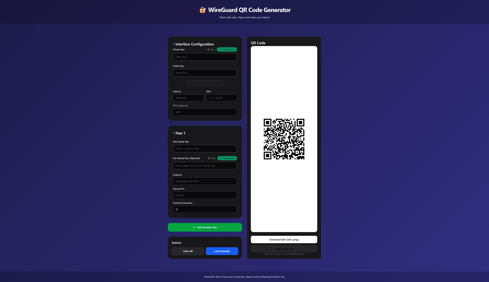

# WireGuard QR Code Generator

A **100% client-side** React application for generating WireGuard VPN configurations and QR codes. All cryptographic operations happen in your browser—private keys never leave your device.

## Features

✅ **Client-Side Only** - All processing happens in your browser  
✅ **No Backend** - No server communication, no data collection  
✅ **Secure Key Generation** - Generate WireGuard key pairs locally  
✅ **QR Code Generation** - Scan configs directly into WireGuard mobile apps  
✅ **Config Upload** - Parse existing `.conf` files  
✅ **Download Configs** - Export complete WireGuard client configurations  
✅ **Real-Time Validation** - Instant feedback on form inputs with helpful error messages  
✅ **Multi-Peer Support** - Add, edit, and remove multiple VPN peers  
✅ **Offline Support** - Works completely offline  
✅ **TypeScript** - Type-safe codebase  
✅ **Comprehensive Tests** - 24+ unit tests covering validators and crypto operations  
✅ **Docker Ready** - Includes Docker and Docker Compose configurations

## Technology Stack

- **React 19.2** + **TypeScript** - UI framework
- **Vite** - Build tool (fast development and production builds)
- **@noble/curves** - WireGuard X25519 key generation (browser-compatible)
- **Web Crypto API** - Native browser cryptography
- **qrcode.react** - QR code rendering
- **js-base64** - Base64 encoding/decoding
- **Vitest** - Testing framework (33 validator and crypto tests)
- **React Hot Toast** - Toast notifications
- **Lucide React** - Icon library
- **Tailwind CSS** - Utility-first CSS framework

## Security

- ✅ No private keys transmitted
- ✅ No externally callable APIs
- ✅ Memory-only state (React state)
- ✅ No localStorage for sensitive data
- ✅ Autocomplete disabled on sensitive fields
- ✅ Open source and auditable
- ✅ Works offline

## Screenshot



## Installation

```bash
git clone https://github.com/imaginative-elephant/wireguard_qr_js.git
cd wireguard_qr_js
npm install
```

## Development

```bash
# Start development server
npm run dev

# Run tests
npm test

# Run tests with UI
npm run test:ui

# Check test coverage
npm run test:coverage

# Build for production
npm run build

# Preview production build
npm run preview
```

## Project Structure

```
src/
├── components/
│   ├── ConfigBuilder.tsx      # Multi-peer configuration builder with validation
│   ├── KeyGenerator.tsx       # Key pair and PSK generation
│   ├── KeyField.tsx           # Reusable key input with validation
│   ├── QRDisplay.tsx          # QR code display and download
│   └── index.ts               # Component exports
├── utils/
│   ├── crypto.ts              # WireGuard X25519 key generation
│   ├── validators.ts          # Form field validators (with tests)
│   ├── qr.ts                  # QR code utilities
│   ├── configParser.ts        # .conf file parsing
│   ├── download.ts            # File download helpers
│   └── index.ts               # Utils exports
├── App.tsx                    # Main application shell
└── main.tsx                   # React entry point
```

## Usage

1. **Generate Interface Key Pair**
   - Click "Generate New Key Pair" in the Interface section
   - Public key is displayed (share with server admin)
   - Private key is hidden and validated in real-time

2. **Configure Interface Settings**
   - Enter your client Address (e.g., `10.0.0.2/32`)
   - Add DNS servers (comma-separated IPv4/IPv6)
   - Optional: Set MTU value
   - All fields validate in real-time

3. **Add Peer(s)**
   - Click "+ Add Peer" to add VPN server configurations
   - Paste or generate server's public key
   - Optional: Generate or paste pre-shared key
   - Enter server endpoint (hostname:port or IP:port)
   - Specify allowed IPs (comma-separated CIDR notation)
   - Optional: Set persistent keepalive interval
   - Remove peers with the trash icon

4. **Generate Pre-Shared Key (PSK)**
   - Click "Generate PSK" button for additional symmetric encryption

5. **Generate QR Code**
   - QR code auto-generates when configuration is valid
   - Scan with your WireGuard mobile app

6. **Download Configuration**
   - Export complete configuration as `.conf` file

7. **Upload Existing Config**
   - Parse existing `.conf` files to populate all forms

### Crypto Utils

```typescript
import { generateKeyPair, generatePresharedKey, derivePublicKey } from '@/utils';

// Generate a new key pair
const { privateKey, publicKey } = generateKeyPair();

// Generate a preshared key
const { presharedKey } = generatePresharedKey();

// Derive public key from private key
const pubKey = derivePublicKey(privateKey);
```

### Config Parser

```typescript
import { parseWireGuardConfig, generateWireGuardConfig, validateWireGuardConfig } from '@/utils';

// Parse a .conf file
const config = parseWireGuardConfig(fileContent);

// Generate .conf content
const confContent = generateWireGuardConfig(config);

// Validate configuration
const errors = validateWireGuardConfig(config);
```

### Download Utils

```typescript
import { downloadWireGuardConfig, copyToClipboard } from '@/utils';

// Download config file
downloadWireGuardConfig(configContent, 'my-config.conf');

// Copy to clipboard
await copyToClipboard(publicKey);
```

## Example Configuration

```ini
[Interface]
Address = 10.200.200.3/32
PrivateKey = [Client's private key]
DNS = 8.8.8.8

[Peer]
PublicKey = [Server's public key]
PresharedKey = [Pre-shared key]
Endpoint = vpn.example.com:51820
AllowedIPs = 0.0.0.0/0, ::/0
PersistentKeepalive = 21
```

## Browser Support

- Chrome/Edge 90+
- Firefox 88+
- Safari 14+
- Mobile browsers (iOS Safari 14+, Chrome Android)

## Best Practices

1. Always use **HTTPS** in production
2. Keep browsers and OS updated
3. Don't share private keys or PSKs
4. Verify server certificates
5. Use strong DNS providers
6. Test configurations before deployment
7. Rotate keys periodically

## Validation

The application includes real-time validation for all form fields:

- **WireGuard Keys** - 44-character base64 format validation
- **Endpoint** - Hostname or IP address with valid port (1-65535)
- **Allowed IPs** - CIDR notation validation (IPv4 and IPv6)
- **Address** - CIDR notation validation for client address
- **DNS** - IPv4 or IPv6 address validation

Validation errors appear instantly below fields with red borders. Empty optional fields are allowed.

## Testing

```bash
# Run all tests
npm test

# Run tests in watch mode
npm test -- --watch

# Run tests with UI
npm run test:ui

# Generate coverage report
npm run test:coverage
```

**Test Coverage:**

- 24+ unit tests for validators (WireGuard keys, endpoints, IPs, DNS)
- Comprehensive crypto operation tests
- Edge case and error scenario coverage

## Deployment

The app can be deployed to any static hosting:

### Vercel

```bash
npm install -g vercel
vercel
```

### Netlify

```bash
npm install -g netlify-cli
netlify deploy
```

## Docker

Build and run with Docker Compose:

```bash
# Build and start the container
docker compose up --build

# Or build first, then run
docker compose build
docker compose up -d

# Stop the container
docker compose down
```

The application will be available at `http://localhost:8080`.

### GitHub Pages

```bash
# Update package.json with your repository
npm run build
# Deploy the dist/ folder
```

## Environment Variables

Optional configuration via `.env`:

```
VITE_APP_TITLE=WireGuard QR Generator
```

## Contributing

1. Fork the repository
2. Create a feature branch
3. Make your changes
4. Add tests for new features
5. Run `npm test` to verify all tests pass
6. Run `npm run build` to verify production build succeeds
7. Submit a pull request

## License

TBD

## Performance

- ⚡ Vite provides ~10x faster build times
- 🚀 ~95KB gzipped bundle size
- 📱 Mobile-optimized UI
- ♻️ React.memo optimized components

## Security Disclaimer

This application is provided as-is. While we've implemented security best practices:

- Always review the source code
- Run security audits on dependencies regularly
- Use HTTPS in production
- Never share private keys
- Test thoroughly before production use

## Support

- 📝 [GitHub Issues](https://github.com/imaginative-elephant/wireguard_qr_js/issues)
- 💬 [GitHub Discussions](https://github.com/imaginative-elephant/wireguard_qr_js/discussions)

## Related Projects

- [WireGuard Official](https://www.wireguard.com/)
- [WireGuard iOS](https://apps.apple.com/app/wireguard/id1451685025)
- [WireGuard Android](https://play.google.com/store/apps/details?id=com.wireguard.android)

---

**Remember**: Your private keys stay in your device. This application generates them locally and never transmits them anywhere.

```

```
