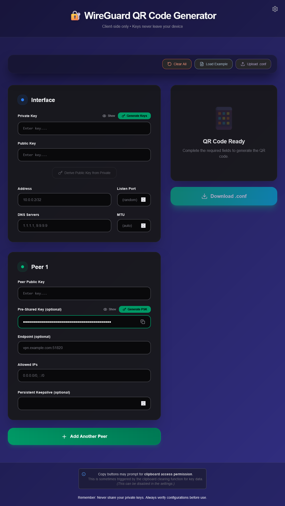
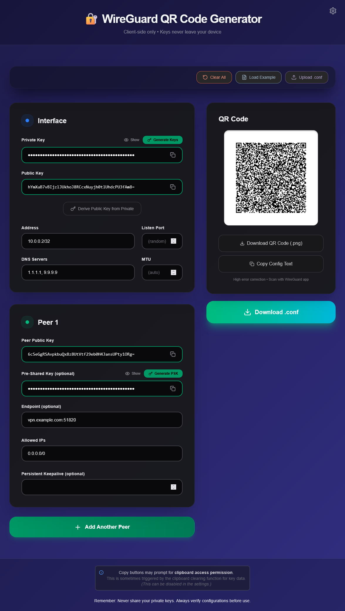
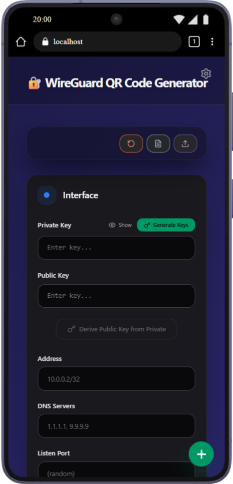
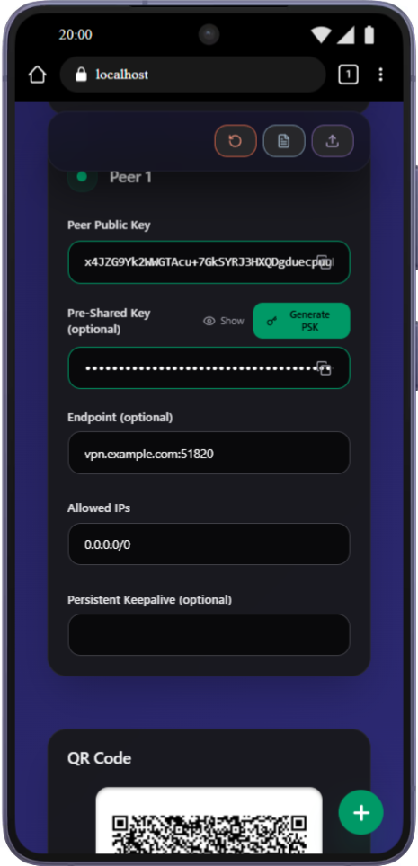

# 🛡️ WireGuard QR Code Generator

Generate secure WireGuard VPN configurations instantly—**all in your browser, with zero data collection**. Create, validate, and share VPN settings via QR code, all with military-grade encryption happening locally on your device.

Perfect for:

- **WireGuard Administrators** setting up client configurations quickly
- **Privacy-Conscious Users** who don't want to share VPN configs/sensitive info over email or other medium
- **Mobile-First Deployments** scanning QR codes directly into WireGuard apps
- **Offline Environments** that need zero dependencies

## Key Features

- **100% Client-Side** — Everything runs in your browser, nothing sent to servers
- **Zero Tracking** — No backend, no analytics, no data collection whatsoever
- **Secure Key Generation** — Generate cryptographic key pairs using native Web Crypto APIs
- **QR Code Export** — High-error-correction QR codes ready to scan into WireGuard apps
- **Config Upload/Import** — Parse existing `.conf` files and continue editing
- **Download Configs** — Export complete WireGuard client configurations as `.conf` files
- **Real-Time Validation** — Instant, helpful feedback on every input field
- **Multi-Peer Support** — Easily manage multiple VPN server configurations
- **Offline Mode** — Works completely offline with PWA support
- **Docker Ready** — One-click deployment with Docker Compose
- **Type-Safe** — Full TypeScript implementation for reliability

## Quick Start

**Via NPM:**

```bash
git clone https://github.com/imaginative-elephant/wireguard_qr_js.git
cd wireguard_qr_js
npm install
npm run dev
```

**Via Docker:**

```bash
docker compose up --build
# Open http://localhost:3000
```

Then visit `http://localhost:5173` (dev) or `http://localhost:8080` (Docker).

## How It Works

1. **Configure Your Interface** — Enter your WireGuard interface private key and network settings
2. **Add VPN Peers** — Add one or more server configurations (public key, endpoint, allowed IPs)
3. **Generate QR Code** — The app creates a high-error-correction QR code in real-time
4. **Share Easily** — Scan the QR into WireGuard on your phone, or download the `.conf` file
5. **Everything Stays Local** — No server ever sees your keys or configuration

## Technology Stack

- **React 19.2** + **TypeScript** — Modern, type-safe UI
- **Vite** — Lightning-fast build tool and dev server
- **Web Crypto API** — Native browser cryptography (no external crypto libs)
- **@noble/curves** — Battle-tested WireGuard X25519 key operations
- **React Hook Form + Zod** — Robust form state and validation
- **Tailwind CSS v4** — Responsive, utility-first styling
- **lucide-react** — Beautiful icon set

## Security & Privacy

- ✅ **Zero Network Exposure** — Private keys never leave your browser
- ✅ **No Backend Services** — No servers to compromise, no data collection APIs
- ✅ **Memory-Only State** — Sensitive data kept only in browser memory, not localStorage
- ✅ **Autocomplete Disabled** — Sensitive fields opt-out of browser autocomplete
- ✅ **Fully Open Source** — Audit the code yourself—no hidden logic
- ✅ **Offline Capable** — Works without internet connection (PWA)
- ✅ **No Third-Party Analytics** — No tracking scripts, beacons, or analytics libraries
- ✅ **No External Dependencies for Crypto** — Uses native Web Crypto API + audited @noble/curves

**For maximum security:**

- Always verify the source URL matches (check SSL certificate)
- Review the open-source code before deployment
- Test configurations before production use
- Rotate keys periodically
- Never share your private keys

## Screenshots

### Desktop

<!-- <div align="center">
  <div style="display: flex; justify-content: center; gap: 20px; max-width: 800px;">
    <div style="flex: 1; text-align: left;">
      <b>Configuration Builder</b><br>
      
    </div>
    <div style="flex: 1; text-align: left;">
      <b>QR Code Generated & Ready to Scan</b><br>
      
    </div>

  </div>
</div> -->

| **Configuration Builder**                                                                                                                                    | **QR Code Generated & Ready to Scan**                                                                                                                                         |
| ------------------------------------------------------------------------------------------------------------------------------------------------------------ | ----------------------------------------------------------------------------------------------------------------------------------------------------------------------------- |
|  |  |

<!-- <h4 width="47%"> Configuration Builder </h4>
  -->

---

### Mobile (with Responsive UI)

<!--  -->

| **Configuration Builder**                                                                                                       | **QR Code Generated**                                                                                                     |
| ------------------------------------------------------------------------------------------------------------------------------- | ------------------------------------------------------------------------------------------------------------------------- |
|  |  |

<!-- <div align="center">
  <div style="display: flex; justify-content: center; gap: 20px; max-width: 800px;">
    <div style="flex: 1; text-align: left;">
      <b>Configuration Builder</b><br>
      
    </div>
    <div style="flex: 1; text-align: left;">
      <b>Configuration Builder with Values</b><br>
      
    </div>

  </div>
</div> -->

<!--  -->

## Development Commands

```bash
# Start development server
npm run dev

# Run tests
npm test

# Run tests in watch mode
npm run test:watch

# Run tests with UI
npm run test:ui

# Check test coverage
npm run test:coverage

# Build for production
npm run build

# Preview production build
npm run preview
```

## How to Use

### For First-Time Users

1. **Generate Your Private Key**
   - Click the green **"Generate Keys"** button in the Interface section
   - Your private key will be hidden (toggle the eye icon to see/hide)
   - Your public key automatically appears below—this is what you share with the VPN admin

2. **Set Up Your Network**
   - **Address**: Your client IP within the VPN (e.g., `10.0.0.2/32`)
   - **DNS** (Optional): Which DNS servers to use (e.g., `1.1.1.1, 9.9.9.9` or `10.0.0.1`)
   - **Listen Port** (Optional): Leave blank for random port
   - **MTU** (Optional): Network packet size (usually automatic)

3. **Add Your VPN Server (Peer)**
   - **Peer Public Key**: Paste the server's public key from your VPN admin
   - **Endpoint**: Server address and port (e.g., `vpn.example.com:51820`)
   - **Allowed IPs**: Which traffic goes through VPN (e.g., `0.0.0.0/0` for everything or `10.0.0.0/24` for split tunnel)
   - **Pre-Shared Key** (Optional): Extra security layer— can generate with `Generate` button

4. **Get Your QR Code or Config**
   - QR code appears automatically on the right side when everything is valid and the minimum fields are completed
   - **Scan to Phone**: Use WireGuard app to scan the QR
   - **Download File**: Click "Download .conf" to get a `.conf` file
   - **Copy to Clipboard**: Click "Copy Config Text" to paste elsewhere
5. Click **"+ Add Another Peer"** for additional peers (bottom)

### For Advanced Users

- **Load Example**: Pre-fill with a sample config to see how it works
- **Upload .conf**: Already have a config? Upload it to edit or regenerate QR
- **Multiple Peers**: Add multiple VPN servers in one config (click + button repeatedly)
- **Clear All**: Wipe form and start fresh (yellow button)

## Project Structure

```
src/
├── components/               # React UI components
│   ├── ConfigBuilder.tsx     # Main form with multi-peer support
│   ├── KeyField.tsx          # Sensitive key input with show/hide & generate
│   ├── ValidatedInput.tsx    # Regular validated input
│   ├── QRDisplay.tsx         # QR code rendering and download
│   ├── SettingsModal.tsx     # Settings (clipboard copy behavior)
│   └── ...
├── utils/                    # Core business logic (security-critical)
│   ├── crypto.ts             # Key generation & derivation
│   ├── validators.ts         # Input validation rules
│   ├── configParser.ts       # Parse/generate .conf files
│   ├── validationSchema.ts   # Zod schema (single source of truth)
│   └── ...
├── types/                    # TypeScript definitions
└── App.tsx                   # Application shell
```

## How It Validates

Every field validates **in real-time** as you type:

| Field              | Rules                                           |
| ------------------ | ----------------------------------------------- |
| **WireGuard Keys** | Must be valid base64, 44 chars, 32-byte decoded |
| **Endpoint**       | Hostname or IP + port (1–65535)                 |
| **Allowed IPs**    | Valid CIDR notation (IPv4 & IPv6)               |
| **DNS**            | Valid IPv4 or IPv6 addresses                    |
| **Address**        | Valid CIDR format                               |

Errors appear **instantly** below each field with helpful hints.

## Testing

The codebase includes comprehensive unit tests for all security-critical functions:

```bash
npm test              # Run all tests once
npm run test:watch   # Run in watch mode (re-run on file changes)
npm run test:ui      # Open browser-based test UI
npm run test:coverage # Generate coverage report (see coverage/ directory)
```

**Test Coverage:**

- 72+ validator tests (WireGuard keys, endpoints, IPs, DNS)
- Cryptographic operation tests (key generation, derivation)
- Config parser tests (read/write `.conf` files)
- Error handling and edge cases
- Real-time validation scenarios

All tests are in `src/**/*.test.ts` files.

## New to WireGuard?

**WireGuard** is a modern VPN protocol that's fast, secure, and easy to use. Here's the quick version:

- **Private Key** — Secret number only you know (keep it safe!)
- **Public Key** — Derived from private key, you share this with the VPN admin
- **Endpoint** — VPN server address + port (e.g., `vpn.example.com:51820`)
- **Allowed IPs** — Which traffic routes through the VPN (e.g., all internet `0.0.0.0/0`)
- **Pre-Shared Key** (PSK) — Optional extra security layer (like a password)

**Getting Started:**

1. Setup a WireGuard VPN server (out-of-scope)
2. You get the **Peer/Server's public key** and **endpoint** from your configuration in #1
3. Use this tool to generate your private/public key pair
4. Set your interface public key to the _WireGuard VPN server's peer_ public key
5. Create your config here and scan it into WireGuard
6. You're connected!

**Learn More:**

- [WireGuard Official Site](https://www.wireguard.com/)
- [Quick Start Guide](https://www.wireguard.com/quickstart/)
- [WireGuard iOS App](https://apps.apple.com/app/wireguard/id1451685025)
- [WireGuard Android App](https://play.google.com/store/apps/details?id=com.wireguard.android)

## For Developers

Want to contribute or understand the codebase?

→ **[docs/ARCHITECTURE.md](docs/ARCHITECTURE.md)** — System design and data flow  
→ **[docs/DEVELOPER.md](docs/DEVELOPER.md)** — API examples and utility functions

Deploy the static build (`dist/`) to any static host:

- **Vercel** — `vercel deploy` (default)
- **Netlify** — Drag & drop `dist/` folder
- **GitHub Pages** — Configure in repo settings
- **Any CDN** — CloudFlare, AWS S3 + CloudFront, etc.

### Docker

Build and run with Docker Compose:

```bash
# Build and start the container
docker compose up --build

# Or build first, then run
docker compose build
docker compose up -d

# Stop the container
docker compose down
```

The application will be available at `http://localhost:8080`.
See `compose.yml` and `Dockerfile` for details (multi-stage build with Nginx).

## Environment Variables

Optional configuration via `.env`:

```env
# Timezone (e.g. Europe/London, America/New_York, Asia/Tokyo)
TZ=UTC
```

## License

TBD

## Performance

- ⚡ Vite provides ~10x faster build times
- 🚀 ~127KB gzipped bundle size (with gzip compression support)
- 📱 Mobile-optimized UI
- ♻️ React.memo optimized components

## Security Disclaimer

This application is provided as-is. While best security practices have implemented as much as possible:

- Always review the source code
- Run security audits on dependencies regularly
- Use HTTPS in production
- Never share private keys
- Test thoroughly before production use

## Support

- [GitHub Issues](https://github.com/imaginative-elephant/wireguard_qr_js/issues)
- [GitHub Discussions](https://github.com/imaginative-elephant/wireguard_qr_js/discussions)

## Related Projects

- [WireGuard Official](https://www.wireguard.com/)
- [WireGuard iOS](https://apps.apple.com/app/wireguard/id1451685025)
- [WireGuard Android](https://play.google.com/store/apps/details?id=com.wireguard.android)

---

**Remember**: Your private keys stay in your device. This application generates them locally and never transmits them anywhere.
