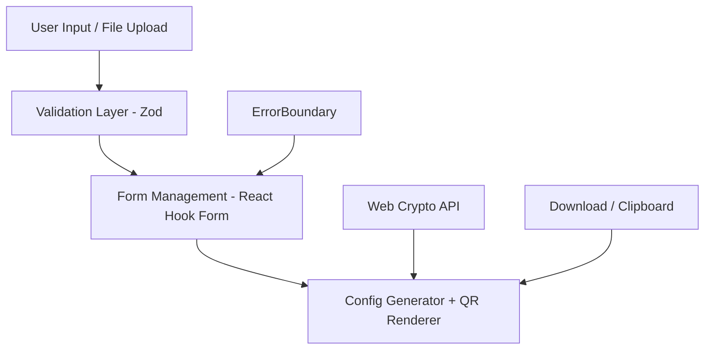
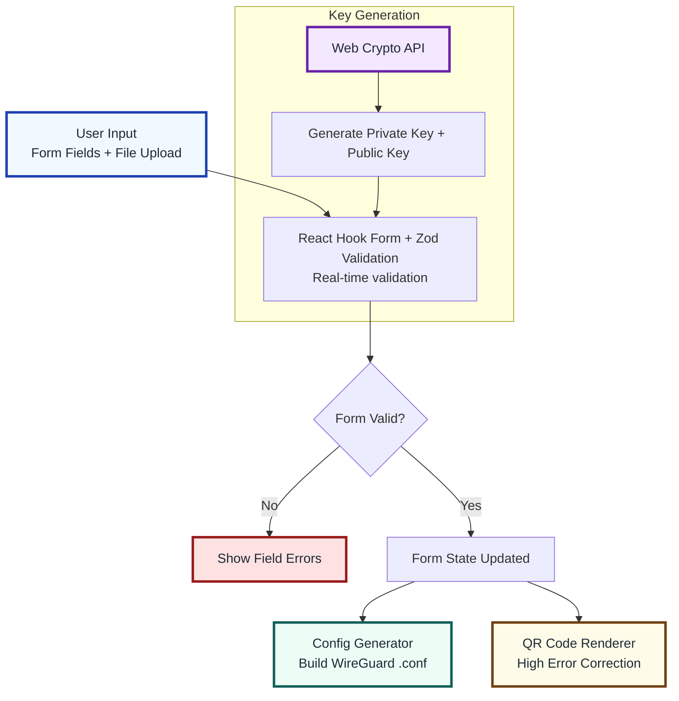

# WireGuard QR Code Generator — Architecture Guide

## System Overview

This is a **100% client-side** React application for generating WireGuard VPN configurations with QR codes. All sensitive operations (key generation, validation, config building) happen in the browser—nothing touches a server.

### Core Design Principles

1. **Security First** — Defense-in-depth: sanitize → validate → render
2. **Zero Backend** — No servers needed for any cryptographic operations
3. **Type Safety** — Full TypeScript with Zod schema validation
4. **User-Focused** — Real-time feedback with clear error messages
5. **Testability** — 70+ unit tests covering security-critical paths
6. **Offline First** — Works completely offline (PWA capable)

## High Level Architecture



</br></br>

## Data Flow Architecture



## Core Components

### 1. Form State Management

**Location:** `src/components/ConfigBuilder.tsx`

Uses **React Hook Form** for efficient form state management:

- Handles touched/dirty flags for better UX
- Lazy validation (only when interacted)
- Field-level error tracking
- Prevents unnecessary re-renders with `useWatch()`

```tsx
const form = useForm<ConfigFormData>({
  resolver: zodResolver(configSchema),
  mode: 'onChange',
  reValidateMode: 'onChange',
});
```

### 2. Validation Layer

**Location:** `src/utils/validationSchema.ts`

Single source of truth for all validation rules using **Zod**:

- Declarative validation with custom `superRefine()` logic
- Validates: keys, endpoints, IPs, DNS, addresses
- Provides human-readable error messages
- Type-safe: TypeScript types derived from Zod schema
- Uses `validators.ts` for validation logic

```tsx
// Example: WireGuard key validation
interfacePrivateKey: createKeySchema('Private Key').min(1, 'Private key is required'),
...
```

### 3. Cryptographic Operations

**Location:** `src/utils/crypto.ts`

Secure key generation using native APIs:

- **Web Crypto API:** Native browser cryptography (ECDH key derivation)
- **X25519 Keys:** `@noble/curves` (audited crypto library)
- **Fallback:** Graceful fallback to `@noble/curves` if Web Crypto unavailable
- **No localStorage:** Sensitive keys only in memory

```tsx
export async function generateKeyPair(): Promise<KeyPair> {
  try {
    // Attempts Web Crypto API first (recommended)
    // Falls back to @noble/curves if unavailable
  }
}
```

### 4. Configuration Builder

**Location:** `src/utils/configParser.ts`

Converts app state → `.conf` format and vice versa:

- Parses existing `.conf` files with INI parser
- Generates valid WireGuard configuration
- Handles optional fields gracefully
- Type-safe interface/peer config objects

```tsx
const confContent = generateWireGuardConfig({
  interface: { privateKey, address, dns, listenPort, mtu },
  peers: [{ publicKey, endpoint, allowedIps, ... }]
});
```

### 5. UI Components (React Patterns)

#### KeyField Component

- Show/hide toggle for sensitive data
- Copy-to-clipboard with optional auto-clear
- One-click key generation
- Real-time validation feedback

#### ValidatedInput Component

- Wrapper around `<input>` with validation
- Real-time error display below field
- Focus-based validation triggers
- Accessibility features (ARIA labels)

#### QRDisplay Component

- Lazy-loaded (code-split with `React.lazy()`)
- High-error-correction QR codes
- Download as PNG + copy raw config
- Fallback UI while loading

#### ErrorBoundary Component

- Catches React errors globally
- Prevents app crash on unexpected errors
- Shows helpful error message to user

## Validation Strategy

### Validation Features

- **Zod Schema** (`validationSchema.ts`): Declarative, type-safe rules with custom `superRefine` logic
- **React Hook Form**: Handles state, touched/dirty flags, and performance
- **UI Feedback**: Real-time validation on `onChange`, with focus-based error display for required fields
- **Separation of Concerns**: Schema defines rules, components handle presentation

---

### Three-Layer Defense

1. **Input Sanitization (thin)** — Trim whitespace, normalize formatting. No data is sent to the server so XSS, etc. is not a risk
2. **Schema Validation** — Zod validates against rules
3. **Business Logic** — Extra checks (e.g., at least one peer with public key)

### Validation Timing

| When            | What                       | Effect                   |
| --------------- | -------------------------- | ------------------------ |
| **onChange**    | Real-time as user types    | Instant feedback         |
| **onBlur**      | When user leaves field     | More thorough check      |
| **onFocus**     | When user enters field     | Re-validate known issues |
| **Form Submit** | Before download/generation | Final gate check         |

### Error Messages

Each validator returns human-readable (non-vague) errors:

- "Must be exactly 44 characters" (e.g., not "Invalid format")
- "Port must be 1–65535" (e.g., not "Bad number")
- "Enter at least one peer with public key" (e.g., not "Config invalid")

## Security Architecture

### Secure Features

1. **No Network Requests** — All sensitive operations local-only
2. **Memory-Only State** — Nothing persisted to localStorage/IndexedDB
3. **Autocomplete Disabled** — Sensitive fields have `autoComplete="off"`
4. **No Third-Party Scripts** — No analytics, trackers, or ads
5. **Open Source** — Fully auditable, no hidden logic
6. **Modern Crypto** — Uses native Web Crypto API + @noble/curves

### Key Generation Flow

```
User clicks "Generate Keys"
  ↓
Browser native Web Crypto API (preferred) OR @noble/curves
  ↓
X25519 key pair (industry standard for WireGuard)
  ↓
Encoded as base64 strings
  ↓
Stored in React state (memory only)
  ↓
Never sent to any server
```

### Private Key Storage

- **Never persisted** to disk/localStorage
- **Never transmitted** over network
- **Cleared on page refresh** (by design)
- **User must save** by downloading .conf or copying to clipboard

## Performance Optimizations

### Code Splitting

- QR display lazy-loaded with `React.lazy()`
- Shows loading placeholder while importing

### Component Memoization

- `useMemo()` prevents expensive recalculations
- Form state split to minimize renders
- `useWatch()` only re-renders affected fields

### Bundle Size

- ~127KB gzipped (production build)
- Vite tree-shaking removes unused code
- Minimal dependencies (React, Zod, @noble/curves)

## Directory Structure

```
src/
├── components/              # React UI components
│   ├── ConfigBuilder.tsx    # Main form component (multi-peer)
│   ├── KeyField.tsx         # Sensitive key input (show/hide, generate)
│   ├── ValidatedInput.tsx   # Validated <input> wrapper
│   ├── ErrorBoundary.tsx    # React error boundary
│   └── ...
│
├── utils/                   # Security & critical business logic
│   ├── crypto.ts            # Key generation & derivation
│   ├── validators.ts        # Validation functions
│   ├── validationSchema.ts  # Zod schema (uses validation functions)
│   ├── configParser.ts      # .conf file parsing/generation
│   └── ...
│
├── types/
│   └── wireguard.ts         # WireGuard config types
│
├── App.tsx                  # App root component
├── App.css                  # Global styles
├── main.tsx                 # React entry point
├── index.css                # Tailwind CSS entry
└── ...
```

## Testing Strategy

### Unit Test Coverage

1. **Validators** (`src/utils/validators.test.ts`)
   - Valid/invalid WireGuard keys
   - Valid/invalid endpoints (IP, hostname, port ranges)
   - Valid/invalid CIDR notations (IPv4 & IPv6)
   - DNS address validation
   - Edge cases and boundary testing

2. **Crypto** (`src/utils/crypto.test.ts`)
   - Key generation consistency
   - Key derivation correctness
   - Error handling for invalid inputs

3. **Config Parser** (`src/utils/crypto.test.ts`)
   - Parse valid `.conf` files
   - Generate valid `.conf` output
   - Handle missing optional fields

### Running Tests

```bash
npm test              # Run all tests
npm run test:watch   # Watch mode
npm run test:coverage # Coverage report (see coverage/index.html)
```

## Development Primer

### Adding a New Feature

1. **Add validation rule** → `src/utils/validators.ts`
2. **Add to Zod schema** → `src/utils/validationSchema.ts`
3. **Add component** → `src/components/YourComponent.tsx`
4. **Add tests** → `src/utils/YourUtility.test.ts`
5. **Update types** → `src/types/wireguard.ts` if needed

**See:** [DEVELOPER.md](DEVELOPER.md) for API documentation and code examples.

## Browser Compatibility

- Chrome/Edge 90+
- Firefox 88+
- Safari 14+
- iOS Safari 14+ (mobile WireGuard scanning)
- Chrome Android

Requires:

- ES2020+ JavaScript support
- CSS Grid support
- Web Crypto API support (`@noble/curves` fallback available)
